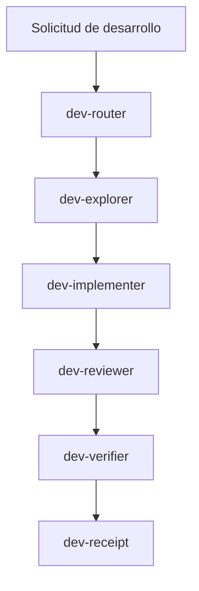

# Development Agents

Esta carpeta contiene agentes temporales para desarrollar T.H.O.T.H.

No forman parte del comportamiento final del sistema de memoria. Son una capa de trabajo inspirada en el flujo basico de Gentle-AI: entender con alcance acotado, implementar con foco, revisar el candidato y verificar antes de entregar.

## Estado

Estos agentes son temporales.

Pueden cambiar, fusionarse o eliminarse cuando T.H.O.T.H. tenga su propio flujo de desarrollo interno.

## Flujo Basico

## Agentes

- `dev-router`: decide si el trabajo se hace directo o requiere agentes temporales.
- `dev-explorer`: explora el codigo y devuelve contexto acotado.
- `dev-implementer`: implementa cambios concretos.
- `dev-reviewer`: revisa bugs, riesgos y regresiones.
- `dev-verifier`: ejecuta typecheck, build, tests o comprobaciones necesarias.
- `dev-receipt`: resume lo hecho, evidencia y estado final.

## Principios

- Mantener el trabajo pequeno y directo cuando sea posible.
- Delegar exploracion si hace falta leer mucho contexto.
- Implementar solo lo necesario.
- Revisar despues de implementar, no antes.
- Verificar con comandos reales cuando sea viable.
- Entregar un resumen claro con evidencia.
