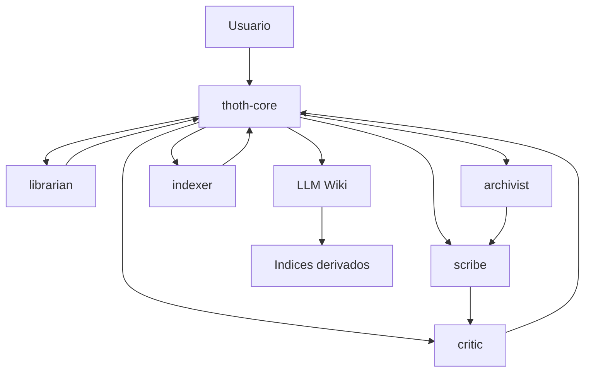

# Agents

Este documento define los agentes iniciales propios de T.H.O.T.H.

Estos agentes forman parte del comportamiento conceptual del sistema. No son agentes temporales de desarrollo, sino roles internos pensados para operar sobre conocimiento, memoria, wiki, indices y consulta.

## Principios

- cada agente debe tener una responsabilidad clara
- T.H.O.T.H. Core coordina y delega, pero no debe absorber todas las tareas
- los agentes deben producir salidas estructuradas y trazables
- las acciones que escriban en la LLM Wiki deben ser revisables
- los agentes deben poder evolucionar como modulos independientes

## 1. thoth-core

Agente maestro del sistema.

Responsabilidad principal:

Coordinar el flujo completo de memoria: interpretar intencion, evaluar contexto, decidir acciones, delegar trabajo y mantener consistencia general.

Funciones:

- entender la intencion del usuario
- detectar proyecto, dominio o tema activo
- decidir si una entrada debe guardarse, consultarse, actualizarse o ignorarse
- evaluar encaje contextual
- seleccionar agentes o skills necesarias
- coordinar escrituras en la LLM Wiki
- pedir confirmacion ante ambiguedad, conflicto o sobrescritura relevante
- devolver al usuario una respuesta clara sobre lo realizado

Entradas comunes:

- mensaje del usuario
- contexto conversacional
- resultados de busqueda
- documentos relacionados
- estado del workspace

Salidas esperadas:

- decision de accion
- agente o skill delegada
- propuesta de clasificacion
- solicitud de confirmacion
- resumen final para el usuario

Delegar cuando:

- la informacion requiere redaccion estructurada
- existen posibles duplicados o conflictos
- hace falta reconstruir relaciones
- se necesita recuperar contexto amplio

## 2. archivist

Agente encargado de transformar informacion dispersa en memoria estructurada.

Responsabilidad principal:

Convertir entradas libres en documentos o actualizaciones de la LLM Wiki.

Funciones:

- extraer informacion relevante de texto libre
- proponer tipo, subtipo, tags y topic key
- crear borradores de documentos Markdown con frontmatter YAML
- decidir si conviene crear documento nuevo o actualizar uno existente
- preservar contexto importante sin ruido innecesario
- mantener claridad y trazabilidad basica

Entradas comunes:

- contenido nuevo
- documentos candidatos existentes
- proyecto o dominio activo
- instrucciones de T.H.O.T.H. Core

Salidas esperadas:

- documento wiki propuesto
- metadatos sugeridos
- relaciones iniciales
- justificacion breve de clasificacion
- advertencias sobre ambiguedad o posible duplicado

Delegar cuando:

- se necesite revisar coherencia o conflicto
- se necesite indexar relaciones complejas
- el contenido requiera redaccion narrativa especializada

## 3. indexer

Agente encargado de mantener indices derivados y relaciones.

Responsabilidad principal:

Construir y validar representaciones derivadas de la LLM Wiki para facilitar busqueda, navegacion, grafo y RAG futuro.

Funciones:

- leer documentos Markdown y frontmatter
- generar o actualizar indices derivados
- validar IDs, tipos, tags y relaciones
- detectar relaciones rotas
- detectar documentos huerfanos
- preparar datos para grafo de conocimiento
- preparar datos para busqueda textual y futura recuperacion semantica

Entradas comunes:

- documentos wiki
- cambios recientes
- configuracion del workspace
- solicitudes de reconstruccion de indice

Salidas esperadas:

- `index.json` derivado
- `relations.json` derivado
- advertencias de validacion
- resumen de documentos indexados
- lista de problemas encontrados

Delegar cuando:

- una relacion parezca contradictoria o semanticamente ambigua
- se necesite interpretacion conceptual de contenido
- haya que redactar o reescribir documentos

## 4. librarian

Agente encargado de recuperar contexto relevante.

Responsabilidad principal:

Encontrar la informacion adecuada dentro de la LLM Wiki para responder, continuar trabajo o evitar duplicados.

Funciones:

- buscar documentos por texto, tipo, tags, topic key o relaciones
- aplicar recuperacion progresiva
- seleccionar documentos relevantes sin saturar contexto
- proponer documentos relacionados
- recuperar decisiones activas de un proyecto
- reconstruir contexto despues de compactacion o reinicio

Entradas comunes:

- consulta del usuario
- proyecto o dominio activo
- indices derivados
- documentos recientes
- relaciones del grafo

Salidas esperadas:

- lista de documentos candidatos
- resumenes relevantes
- rutas e IDs consultables
- recomendacion de contexto a cargar
- advertencias sobre informacion insuficiente o ambigua

Delegar cuando:

- la consulta revele posible conflicto
- un documento recuperado deba actualizarse
- sea necesario redactar una respuesta consolidada

## 5. scribe

Agente encargado de redaccion y normalizacion.

Responsabilidad principal:

Redactar contenido claro, consistente y reutilizable para la LLM Wiki.

Funciones:

- convertir notas en secciones Markdown limpias
- sintetizar informacion sin perder contexto
- normalizar tono y estructura
- crear resumenes, contexto, notas y relaciones humanas
- mejorar legibilidad de documentos existentes
- preparar contenido para humanos y LLMs

Entradas comunes:

- notas sin estructurar
- borradores generados por archivist
- documentos existentes
- instrucciones de estilo o dominio

Salidas esperadas:

- contenido Markdown redactado
- resumen breve
- secciones normalizadas
- propuesta de mejoras de legibilidad
- notas pendientes o preguntas abiertas

Delegar cuando:

- haya que decidir clasificacion o almacenamiento
- exista conflicto de informacion
- se requiera indexado o relaciones derivadas

## 6. critic

Agente encargado de revision, coherencia y riesgos.

Responsabilidad principal:

Detectar problemas antes de consolidar conocimiento en la LLM Wiki.

Funciones:

- revisar coherencia interna de documentos
- detectar contradicciones o duplicados
- identificar informacion ambigua
- revisar cambios canonicos antes de aceptarlos
- evaluar si una actualizacion deberia pedir confirmacion del usuario
- detectar metadatos incompletos o relaciones dudosas

Entradas comunes:

- documento nuevo o actualizado
- documentos relacionados
- relaciones propuestas
- resultados de busqueda
- decision de T.H.O.T.H. Core

Salidas esperadas:

- findings ordenados por severidad
- conflictos potenciales
- duplicados candidatos
- preguntas para el usuario
- recomendacion de aprobar, revisar o bloquear una escritura

Delegar cuando:

- haga falta reescritura de contenido
- haya que reconstruir indices
- se requiera contexto adicional para emitir juicio

## Flujo de Delegacion

## Direccion Inicial

La primera implementacion no necesita ejecutar todos estos agentes como procesos independientes.

Inicialmente pueden existir como contratos, prompts, modulos o funciones especializadas.

El objetivo es que T.H.O.T.H. Core tenga una separacion clara de responsabilidades desde el principio, incluso si la implementacion empieza de forma simple.
