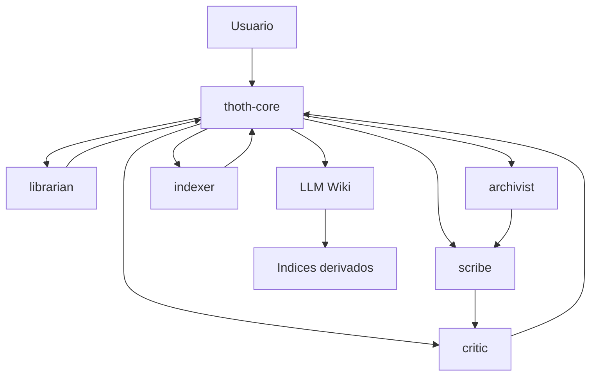

# Agents

Este documento actua como indice general de los agentes propios de T.H.O.T.H.

Las definiciones operativas completas viven en la carpeta `agents/`, organizadas por categoria. Cada archivo de agente usa Markdown con frontmatter YAML para que sea legible por humanos y procesable por T.H.O.T.H. en el futuro.

## Estructura

```text
agents/
  core/
    thoth-core.md
  knowledge/
    archivist.md
    indexer.md
    librarian.md
  writing/
    scribe.md
  review/
    critic.md
```

## Agentes Iniciales

| Agente | Categoria | Definicion | Funcion |
| --- | --- | --- | --- |
| `thoth-core` | `core` | `agents/core/thoth-core.md` | Agente maestro, coordinacion, decision y delegacion. |
| `archivist` | `knowledge` | `agents/knowledge/archivist.md` | Convierte informacion dispersa en memoria estructurada. |
| `indexer` | `knowledge` | `agents/knowledge/indexer.md` | Mantiene indices derivados, relaciones y datos preparados para grafo/RAG. |
| `librarian` | `knowledge` | `agents/knowledge/librarian.md` | Recupera contexto relevante mediante busqueda progresiva. |
| `scribe` | `writing` | `agents/writing/scribe.md` | Redacta y normaliza documentos Markdown para la LLM Wiki. |
| `critic` | `review` | `agents/review/critic.md` | Revisa coherencia, duplicados, contradicciones y riesgos. |

## Formato de Agente

Cada agente debe definirse como un archivo Markdown con frontmatter YAML.

Campos iniciales:

```yaml
---
id: archivist
name: archivist
category: knowledge
status: draft
version: 0.1.0
purpose: Transform unstructured information into structured LLM Wiki memory.
---
```

Secciones recomendadas:

- responsabilidades
- entradas
- salidas
- reglas de decision
- reglas de delegacion
- forma esperada de respuesta
- handoff hacia otros agentes

## Categorias

### core

Agentes de coordinacion y decision global.

Incluye el agente maestro `thoth-core`.

### knowledge

Agentes dedicados a clasificacion, recuperacion, memoria, relaciones e indices.

Incluye `archivist`, `librarian` e `indexer`.

### writing

Agentes dedicados a redaccion, normalizacion y preparacion de documentos legibles.

Incluye `scribe`.

### review

Agentes dedicados a revision, coherencia, conflictos, duplicados y seguridad de escritura.

Incluye `critic`.

### development

Agentes temporales usados para desarrollar T.H.O.T.H.

No forman parte del comportamiento final del sistema de memoria. Viven en `agents/development/` y siguen un flujo basico inspirado en Gentle-AI: route, explore, implement, review, verify y receipt.

#### Perfil de autonomia segura

El pack ejecutable de OpenCode permite al orquestador delegar sin confirmación únicamente a una lista explícita de agentes propios (`thoth-archivist`, `thoth-indexer`, `thoth-scribe`, `thoth-critic` y los seis `thoth-dev-*`). En el flujo dev, router delega a explorer/implementer/scribe; implementer a reviewer/verifier/scribe; reviewer a verifier/scribe; explorer, verifier y receipt solo a scribe. Los agentes pueden ejecutar autónomamente únicamente checks whitelisted y deben devolver sus resultados.

Este perfil no autoriza ejecución arbitraria ni constituye un sandbox completo: cada agente usa `bash: "*": deny` y una whitelist de comandos concretos para diagnóstico, checks locales, la CLI informativa de OpenCode y `thoth *`. Las comprobaciones whitelisted se ejecutan autónomamente cuando el usuario solicita una tarea; cualquier comando fuera de la whitelist requiere autorización explícita o está denegado. No se permiten intérpretes ni envoltorios para eludirla.

Las denegaciones de lectura y edición de secretos usan patrones (`.aws`, `.npmrc`, credenciales, tokens, claves y formatos de certificados, entre otros) como defensa preventiva; no sustituyen un sandbox completo ni garantizan detectar todos los secretos.

También permanecen bloqueadas o en `ask` las operaciones destructivas generales, secretos, `sudo`, red, instalaciones, `npm exec`, npx remoto, `git diff` amplio y comandos de desarrollo no whitelisted.

El agente primario puede ejecutar `git add*`, `git commit*` y `git push*` únicamente tras una petición explícita del usuario o una instrucción de publicación inequívoca, nunca por iniciativa propia, y mantiene un commit por tarea. Force push (`git push --force*`/`git push -f*`), `git reset*` y `git clean*` siguen bloqueados. Los demás agentes no reciben permisos Git mutantes; el orquestador primario centraliza la publicación y `thoth *` se reserva para operaciones de wiki solicitadas por él.

Estas reglas expresan una política de autorización del agente, no una garantía completa del shell, del proveedor Git ni del repositorio remoto; las credenciales, hooks y permisos externos siguen fuera del alcance de este pack.

`webfetch` y `websearch` son permisos separados de `bash` y pueden seguir permitidos según el agente. La autonomía sin confirmación descrita aquí solo cubre la whitelist local de `bash`; el acceso web conserva sus propias reglas y límites.

## Flujo de Delegacion



## Uso Futuro

T.H.O.T.H. deberia poder descubrir agentes leyendo la carpeta `agents/`.

El frontmatter permitira listar agentes, filtrar por categoria, validar contratos y decidir que agente puede resolver una tarea concreta.

Inicialmente estos agentes pueden funcionar como contratos, prompts o modulos internos. Mas adelante podran convertirse en unidades ejecutables con schemas de entrada/salida y evaluaciones propias.

## Relacion con Skills

Los agentes propios de T.H.O.T.H. pueden apoyarse en skills reutilizables.

El primer skill pack integrado es `skills/llm-wiki/`, basado en el patron LLM Wiki inspirado por Karpathy y por implementaciones comunitarias recientes.

Asignacion inicial:

| Agente | Skills principales |
| --- | --- |
| `thoth-core` | `wiki-config`, coordinacion general del pack |
| `archivist` | `wiki-ingest`, `wiki-crystallize` |
| `librarian` | `wiki-query` |
| `indexer` | `wiki-lint`, `wiki-integrate` |
| `scribe` | redaccion dentro de `wiki-ingest` y `wiki-crystallize` |
| `critic` | revision de outputs de `wiki-lint`, `wiki-integrate` y cambios canonicos |
