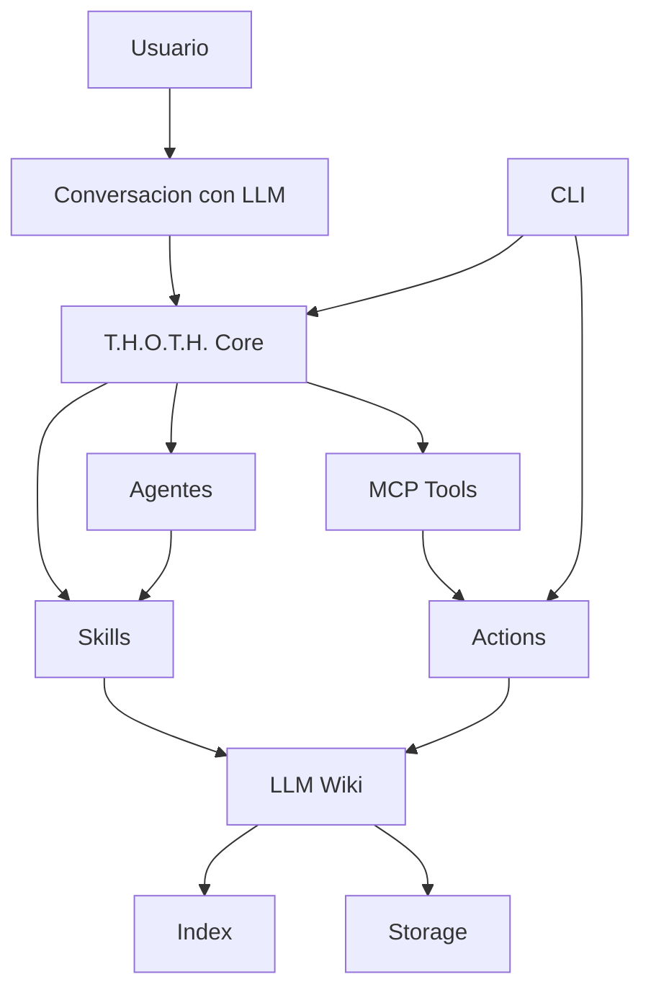
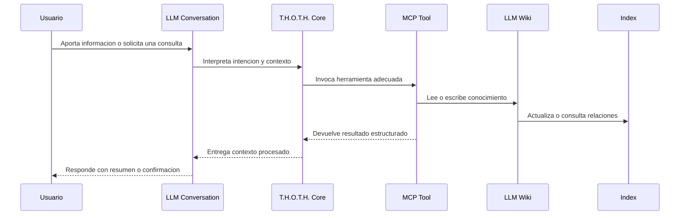

# Architecture

La arquitectura de T.H.O.T.H. se organiza alrededor de un agente maestro encargado de coordinar la entrada, procesamiento, almacenamiento y consulta de conocimiento.

El sistema debe ser modular para permitir que agentes, skills, interfaces y mecanismos de almacenamiento evolucionen de forma independiente.

## Vista General

## Componentes Principales

### T.H.O.T.H. Core

El nucleo ejecutable nuevo (`src/core`) ofrece contratos estructurados y una ruta
provider-agnostic: `planIntent` no interpreta lenguaje natural ni llama modelos,
agentes, shell o proveedores; `executePlan` solo despacha acciones allowlisted.
Las escrituras siempre requieren confirmación explícita.

Responsabilidades iniciales:

- recibir informacion del usuario o de una interfaz
- planificar intents explícitos (`query`, `list`, `show`, `capture`, `update`,
  `append`, `relate`, `log`, `index`, `lint`, `source_add`, `source_link`,
  `clarify`, `ignore`)
- ejecutar handlers locales de lectura y propuestas de escritura
- recuperar consultas progresivamente mediante la skill `wiki-query`, limitada
  a candidatos y snippets

`core_plan`/`core_execute` son la ruta estructurada provider-agnostic: requieren
confirmación para writes y rechazan acciones no atómicas. La CLI y las tools
MCP legacy siguen existiendo por compatibilidad y todavía no están migradas al
Core; por tanto el Core no es una garantía global de toda la aplicación.
Cada plan admite como máximo 20 pasos; los planes mayores se rechazan antes de
ejecutar cualquier paso. `relate`, `log`, `index` y `source_link` aparecen en
el contrato para ser rechazados como no atómicos hasta disponer de transacciones.

En particular, `wiki_show` y los resources MCP son superficies legacy de lectura
intencional: pueden devolver `content`, `raw` o `metadata` bajo demanda. Esa
excepción no aplica a la búsqueda resumida del Core ni a `wiki_search`.

### Agentes

Los agentes son unidades especializadas de razonamiento o ejecucion.

Pueden encargarse de tareas como resumir, redactar, clasificar, revisar coherencia, extraer entidades, construir cronologias o detectar relaciones entre documentos.

Cada agente debe tener una funcion clara y un contrato de entrada/salida definido.

El primer slice ejecutable mantiene separado el registry de metadata y el
runtime. `executeAgent` solo acepta IDs internos allowlisted con runtime
`prompt`; los agentes `opencode` y `external` siguen siendo metadata-only. Las
operaciones `validate`/`plan` no llaman adapters. `execute` recibe un
`AgentAdapter` confiable inyectado, timeout y límites, y valida un output JSON
estructurado. No hay provider por defecto, Markdown, shell, subprocess, red ni
escrituras en esta ruta; el adapter no está sandboxed.

### Skills

Las skills son capacidades reutilizables que pueden ser invocadas por T.H.O.T.H. o por agentes especializados.

Una skill debe resolver una tarea concreta, por ejemplo normalizar notas, generar una ficha de personaje, extraer decisiones de una conversacion o convertir texto libre en una pagina wiki.

### LLM Wiki

La LLM Wiki es la memoria persistente del sistema.

Debe almacenar informacion en documentos legibles, estructurados y faciles de consultar tanto por humanos como por modelos de lenguaje.

La wiki debe priorizar claridad, trazabilidad y relaciones entre piezas de conocimiento.

### Actions

Actions es la superficie interna compartida por CLI y MCP.

Su funcion es estabilizar los contratos operativos antes de llegar a la implementacion concreta de workspace, almacenamiento o wiki.

Inicialmente es una capa delgada, deliberadamente pequena, para evitar abstraccion prematura.

### Storage

El almacenamiento define donde y como se guarda la informacion.

Inicialmente puede basarse en archivos locales, pero la arquitectura debe permitir evolucionar hacia otros mecanismos como bases de datos, indices vectoriales o almacenamiento remoto.

### Index

El indice permite localizar y relacionar informacion dentro de la LLM Wiki.

Puede incluir metadatos, etiquetas, relaciones, resumenes, referencias cruzadas y, en fases futuras, embeddings o busqueda semantica.

### CLI

La CLI sera la primera capa operativa local del sistema.

Debe permitir acciones como inicializar un workspace, administrar configuracion, diagnosticar el estado local, registrar informacion manualmente, consultar conocimiento, listar documentos, ejecutar skills y revisar el estado de la wiki.

### MCP

MCP sera la capa de herramientas que permita a T.H.O.T.H. operar dentro de conversaciones con un LLM.

Debe exponer acciones seguras para capturar, consultar, actualizar y relacionar conocimiento sin depender de comandos manuales.

## Flujo General

1. El usuario introduce informacion mediante una interfaz, inicialmente la CLI.
2. T.H.O.T.H. Core recibe la entrada y analiza su proposito.
3. El Core decide si necesita agentes o skills especializadas.
4. Los agentes o skills procesan la informacion y devuelven resultados estructurados.
5. El Core valida, organiza y escribe el resultado en la LLM Wiki.
6. El indice se actualiza con metadatos y relaciones relevantes.
7. El usuario puede consultar, ampliar o reutilizar el conocimiento almacenado.

## Principios Arquitectonicos

- **Core pequeno:** el nucleo debe coordinar, no absorber todas las responsabilidades.
- **Especializacion:** cada agente o skill debe tener una funcion concreta.
- **Archivos legibles:** la memoria debe ser util incluso sin ejecutar el sistema.
- **Contratos claros:** entradas y salidas deben ser predecibles.
- **Evolucion incremental:** cada componente debe poder empezar simple y crecer con el proyecto.
- **Interoperabilidad:** los datos deben poder ser reutilizados por humanos, LLMs y herramientas externas.

## Direccion Inicial

La primera version deberia enfocarse en un flujo minimo:

1. inicializar un workspace T.H.O.T.H.
2. recibir una nota o bloque de informacion
3. transformarlo en una pagina de LLM Wiki
4. guardarlo en una estructura local
5. permitir una consulta basica desde CLI
