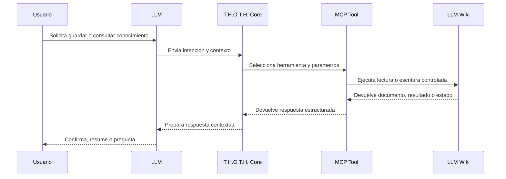
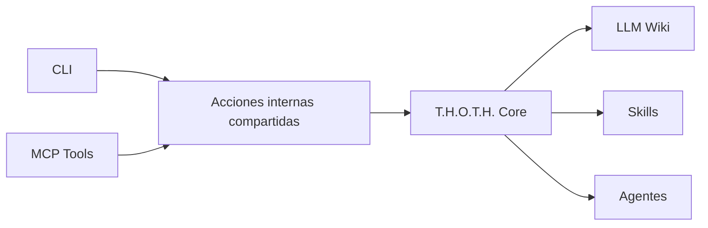

# MCP

MCP sera la capa que permita a T.H.O.T.H. operar dentro de conversaciones con un LLM.

Su funcion es exponer herramientas seguras y estructuradas para que el agente maestro pueda capturar, consultar, actualizar y relacionar conocimiento en la LLM Wiki sin depender de comandos manuales.

## Objetivos

- conectar conversaciones LLM con acciones reales sobre la wiki
- exponer operaciones claras, seguras y auditables
- reutilizar el mismo nucleo interno que la CLI
- permitir que T.H.O.T.H. actue como agente maestro conversacional
- mantener control sobre escrituras, actualizaciones y ejecucion de skills o agentes

## Rol en el Sistema

La conversacion con el LLM es la interfaz principal para el usuario.

MCP actua como puente entre esa conversacion y el sistema local de T.H.O.T.H.

Flujo general:

1. El usuario aporta informacion o realiza una peticion en lenguaje natural.
2. El LLM interpreta la intencion con ayuda de T.H.O.T.H. Core.
3. T.H.O.T.H. decide que herramienta MCP debe invocarse.
4. La herramienta ejecuta una accion controlada sobre la wiki, skills o agentes.
5. El resultado vuelve al LLM.
6. El LLM responde al usuario con una confirmacion, resumen o consulta adicional.



## Relacion con CLI

CLI y MCP deben compartir las mismas acciones internas.

La diferencia esta en la forma de exposicion:

- **CLI:** uso manual desde terminal, administracion local y depuracion.
- **MCP:** uso conversacional por parte de un LLM o agente.



Ejemplo equivalente:

```bash
thoth capture --type note --project project-x --file lore.md
```

```text
capture_knowledge({
  "type": "note",
  "project": "project-x",
  "source_file": "lore.md"
})
```

## Herramientas Iniciales

La primera implementacion expone un servidor stdio ejecutable como `thoth-mcp`.

Herramientas implementadas inicialmente:

- `wiki_search`
- `wiki_list`
- `wiki_show`
- `wiki_capture`
- `wiki_update`
- `wiki_relate`
- `wiki_index`
- `wiki_lint`

Todas reutilizan las acciones internas compartidas con la CLI.

Resources implementados inicialmente:

- `thoth://wiki/index`
- `thoth://document/{id}`

### capture_knowledge

Captura informacion nueva y la convierte en una pagina de la LLM Wiki.

Entrada inicial:

```json
{
  "content": "Texto o informacion a guardar",
  "type": "note",
  "title": "Titulo opcional",
  "tags": ["tag-a", "tag-b"],
  "project": "project-id",
  "source": "conversation"
}
```

Salida inicial:

```json
{
  "document_id": "note-2026-08-02-001",
  "title": "Titulo generado o recibido",
  "path": "wiki/notes/note-2026-08-02-001.md",
  "status": "created"
}
```

Responsabilidades:

- generar metadatos iniciales
- crear documento Markdown con frontmatter YAML
- establecer relaciones basicas cuando sea posible
- actualizar o marcar el indice para regeneracion

### query_knowledge

Consulta conocimiento existente en la LLM Wiki.

Entrada inicial:

```json
{
  "query": "agentes especializados",
  "type": "note",
  "tags": ["agents"],
  "limit": 10
}
```

Salida inicial:

```json
{
  "results": [
    {
      "document_id": "note-agents",
      "title": "Agentes especializados",
      "type": "note",
      "path": "wiki/notes/note-agents.md",
      "summary": "Resumen breve del documento"
    }
  ]
}
```

Responsabilidades:

- buscar en documentos Markdown
- filtrar por metadatos
- devolver resultados resumidos y trazables

### list_documents

Lista documentos de la wiki por filtros simples.

Entrada inicial:

```json
{
  "type": "idea",
  "status": "draft",
  "tag": "cli",
  "limit": 50
}
```

Salida inicial:

```json
{
  "documents": [
    {
      "document_id": "idea-llm-wiki",
      "title": "LLM Wiki",
      "type": "idea",
      "status": "draft",
      "updated_at": "2026-08-02"
    }
  ]
}
```

### show_document

Recupera un documento concreto por ID.

Entrada inicial:

```json
{
  "document_id": "project-thoth",
  "mode": "summary"
}
```

Salida inicial:

```json
{
  "document_id": "project-thoth",
  "title": "T.H.O.T.H.",
  "metadata": {},
  "content": "Contenido solicitado"
}
```

Modos iniciales:

- `summary`
- `full`
- `metadata`

### update_document

Actualiza un documento existente.

Entrada inicial:

```json
{
  "document_id": "project-thoth",
  "operation": "append",
  "content": "Nueva informacion a incorporar",
  "reason": "Ampliar alcance del proyecto"
}
```

Operaciones iniciales:

- `append`
- `replace_section`
- `update_metadata`

Salida inicial:

```json
{
  "document_id": "project-thoth",
  "status": "updated",
  "changed": true
}
```

Responsabilidades:

- evitar sobrescrituras accidentales
- preservar trazabilidad minima
- actualizar `updated_at`
- devolver resumen de cambios

### rebuild_index

Regenera o valida el indice de la wiki.

Entrada inicial:

```json
{
  "validate": true
}
```

Salida inicial:

```json
{
  "status": "completed",
  "documents_indexed": 42,
  "warnings": []
}
```

### run_skill

Ejecuta una skill disponible.

Entrada inicial:

```json
{
  "skill": "summarize",
  "input": {
    "document_id": "note-session"
  }
}
```

Salida inicial:

```json
{
  "skill": "summarize",
  "status": "completed",
  "result": {}
}
```

### run_agent

Ejecuta o invoca un agente especializado.

Entrada inicial:

```json
{
  "agent": "archivist",
  "task": "classify_and_store",
  "input": {
    "content": "Informacion a procesar"
  }
}
```

Salida inicial:

```json
{
  "agent": "archivist",
  "status": "completed",
  "result": {}
}
```

## Seguridad y Control

Las herramientas MCP deben ser explicitas y evitar acciones destructivas por defecto.

Reglas iniciales:

- no sobrescribir documentos completos sin confirmacion o razon explicita
- no eliminar documentos en la primera version
- devolver siempre IDs, rutas y estado de la operacion
- registrar cambios relevantes cuando sea posible
- validar frontmatter antes y despues de escribir
- limitar acceso al workspace configurado
- diferenciar operaciones de lectura y escritura

## Trazabilidad

Cada escritura deberia conservar informacion minima sobre su origen.

Metadatos utiles:

- `source`
- `created_at`
- `updated_at`
- `related`
- `status`

En fases futuras puede añadirse un log de operaciones para auditar cambios realizados por herramientas MCP, CLI, agentes o skills.

## Direccion Inicial

La primera version MCP debe centrarse en herramientas simples sobre archivos locales:

1. capturar conocimiento
2. listar documentos
3. mostrar documentos
4. buscar documentos
5. regenerar indice

La ejecucion avanzada de agentes y skills puede incorporarse cuando el nucleo de lectura/escritura sea estable.
