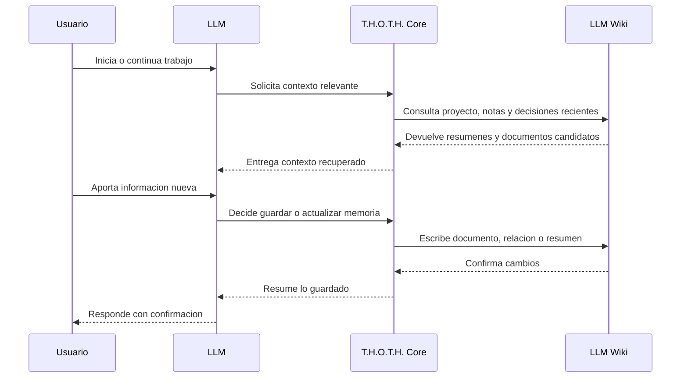

# Memory Protocol

## Core estructurado

El Core usa una relación estricta intent→action. `query` solo usa
`skill.wiki-query` y devuelve candidatos resumidos (máximo 20); no puede
ejecutar `show` ni devolver `content`, `raw` o `metadata`. Para leer un
documento se debe solicitar explícitamente el intent `show` con `wiki.show`,
incluyendo un `id` seleccionado.

Los intents `list`, `show`, `capture`, `update`, `append`, `relate`, `log`,
`index`, `lint`, `source_add` y `source_link` tienen acciones únicas; una acción cruzada se rechaza. Los
planes se validan completamente antes de ejecutarse. Un plan con más de una
escritura devuelve `non_atomic_plan`; las escrituras individuales requieren
`confirmed: true` o el `confirmationToken` exacto de la propuesta; sin ninguno
devuelven `confirmation_required`.
Un plan admite como máximo 20 pasos; superar ese límite devuelve
`plan_too_large` antes de ejecutar cualquier paso.
`core_plan` registra un único evento `core.plan` con superficie `cli` o `mcp`.
Los adapters no auditan por separado; `executePlan` registra propuesta y
resultado, evitando duplicación en lecturas como `wiki_search`.
`wiki_show` y los resources MCP son excepciones intencionales de lectura y
pueden devolver `content`, `raw` o `metadata` cuando se solicitan explícitamente.

El Memory Protocol define cuando y como T.H.O.T.H. debe guardar, consultar, actualizar y relacionar conocimiento durante una conversacion con un LLM.

Su objetivo es evitar que la memoria sea una acumulacion pasiva de notas. T.H.O.T.H. debe actuar de forma intencional: guardar informacion relevante, recuperar contexto util y mantener una LLM Wiki clara, conectada y reutilizable.

## Principios

- **Guardar con criterio:** no todo mensaje merece persistencia.
- **Consultar antes de duplicar:** si una informacion puede pertenecer a un tema existente, T.H.O.T.H. debe buscar primero.
- **Actualizar antes de fragmentar:** el conocimiento evolutivo debe mantenerse en documentos canonicos cuando sea posible.
- **Relacionar conocimiento:** cada nueva pieza importante debe intentar conectarse con documentos previos.
- **Preguntar ante ambiguedad:** si una decision puede sobrescribir, contradecir o fusionar conocimiento relevante, T.H.O.T.H. debe pedir confirmacion.
- **Mantener legibilidad:** la memoria debe seguir siendo util para humanos aunque no se ejecute el sistema.

## Cuando Guardar

T.H.O.T.H. debe proponer o ejecutar guardado cuando detecte informacion con valor futuro.

Casos recomendados:

- decisiones de arquitectura o producto
- definiciones conceptuales del proyecto
- cambios de direccion o alcance
- ideas que el usuario quiera desarrollar mas adelante
- lore, personajes, capitulos o reglas narrativas
- aprendizajes relevantes durante una investigacion
- acuerdos alcanzados en conversacion
- instrucciones persistentes del usuario
- resumenes de sesiones largas
- contradicciones o cambios respecto a conocimiento previo

Casos que normalmente no deben guardarse:

- mensajes puramente conversacionales
- informacion temporal sin valor futuro
- errores corregidos inmediatamente sin aprendizaje relevante
- repeticiones exactas de contenido ya almacenado
- datos sensibles salvo instruccion explicita y confirmacion

## Cuando Consultar

T.H.O.T.H. debe consultar memoria antes de responder o actuar cuando el usuario haga referencia a contexto previo.

Disparadores comunes:

- "recuerda"
- "como lo dejamos"
- "que decidimos"
- "continua"
- "usa el lore"
- "segun el proyecto"
- "busca en la wiki"
- "esto ya lo hablamos"
- inicio de una nueva sesion en un proyecto existente
- despues de una compactacion o perdida de contexto conversacional

Tambien debe consultar proactivamente antes de guardar informacion que parezca pertenecer a un tema ya existente.

## Cuando Actualizar

Actualizar es preferible a crear un documento nuevo cuando la informacion pertenece a un tema estable que evoluciona.

Ejemplos:

- una decision cambia de estado
- una idea gana detalles nuevos
- un proyecto redefine su alcance
- un personaje recibe nueva informacion canonica
- una arquitectura incorpora una nueva restriccion
- una nota amplia se convierte en documento principal

En esos casos T.H.O.T.H. debe localizar el documento canonico y usar una operacion controlada como `append`, `replace_section` o `update_metadata`.

## Encaje Contextual

Antes de guardar informacion nueva, T.H.O.T.H. debe evaluar si encaja dentro del conocimiento actual del sistema.

La entrada puede clasificarse como:

- ampliacion de un documento existente
- actualizacion de una decision o idea previa
- nueva entidad dentro de un proyecto
- nuevo contenido dentro de un dominio existente
- nuevo proyecto o dominio
- contradiccion o reemplazo de informacion previa
- informacion sin clasificacion clara

Flujo recomendado:

1. detectar proyecto, dominio o tema probable
2. buscar documentos, topic keys y relaciones cercanas
3. evaluar si la entrada extiende, contradice o crea conocimiento
4. proponer una accion cuando exista ambiguedad
5. guardar, actualizar o relacionar la informacion segun corresponda

Si la entrada no encaja en la estructura actual, T.H.O.T.H. debe proponer una nueva clasificacion o estructura minima antes de persistirla.

Ejemplo:

```text
Esto parece ampliar `entity/main-archivist`, pero tambien podria ser una nueva entidad.
Quieres actualizar la entidad existente o crear una nueva?
```

## Topic Keys

Los topic keys identifican temas estables que pueden evolucionar con el tiempo.

Formato recomendado:

```text
family/specific-topic
```

Ejemplos:

- `project/thoth`
- `architecture/mcp-layer`
- `decision/no-database-initially`
- `memory/topic-keys`
- `domain/book-writing`
- `entity/main-archivist`
- `content/opening-scene`

Familias iniciales:

- `project`
- `architecture`
- `decision`
- `memory`
- `research`
- `domain`
- `entity`
- `content`
- `skill`
- `agent`

Los topic keys deben ser lowercase, kebab-case y preferiblemente de dos niveles.

Las familias deben ser generales y reutilizables entre dominios. Conceptos especificos como lore, personaje o capitulo pertenecen mejor al tipo, subtipo, tags o estructura interna de un proyecto de escritura.

Ejemplo para un libro:

```yaml
type: entity
subtype: character
project: project-novel-a
topic_key: entity/main-archivist
tags:
  - lore
  - protagonist
```

## Recuperacion Progresiva

T.H.O.T.H. no debe cargar documentos completos por defecto.

Patron recomendado:

1. buscar documentos candidatos por query, tags, tipo o relaciones
2. revisar resumenes y metadatos
3. cargar documento completo solo si es necesario
4. recuperar documentos relacionados cuando aporten contexto

Esto permite que el sistema sea eficiente y evite saturar el contexto del LLM.

## Relaciones

Al guardar o actualizar informacion, T.H.O.T.H. debe intentar detectar relaciones.

Relaciones iniciales:

- `belongs_to`
- `mentions`
- `depends_on`
- `continues`
- `contradicts`
- `supports`
- `references`
- `related_to`
- `has_note`
- `has_decision`
- `has_implementation`
- `derived_from`
- `source_for`
- `supersedes`
- `applies_to`
- `updates`
- `complements`
- `refines`
- `extends`
- `follows`
- `implements`
- `fixes`
- `parallels`
- `verifies`
- `documents`
- `has_log`
- `has_subarea`
- `has_verification`

Si una relacion implica contradiccion, reemplazo o cambio de decision, T.H.O.T.H. debe pedir confirmacion antes de marcarla como canonica.

## Conflictos

Un conflicto ocurre cuando una nueva informacion contradice, reemplaza o invalida informacion previa.

T.H.O.T.H. debe tratar conflictos como eventos importantes, no como errores silenciosos.

Flujo recomendado:

1. detectar posible conflicto mediante busqueda o relaciones
2. presentar el conflicto al usuario de forma breve
3. pedir decision cuando afecte conocimiento canonico
4. guardar la relacion resultante
5. actualizar el documento afectado si procede

Posibles resoluciones:

- `compatible`: ambas informaciones pueden coexistir
- `scoped`: ambas aplican en contextos distintos
- `supersedes`: una informacion reemplaza a otra
- `contradicts`: existe contradiccion activa
- `not_conflict`: no habia conflicto real

## Ciclo de Sesion

T.H.O.T.H. debe poder trabajar con sesiones conversacionales.

Flujo recomendado:



## Resumen de Sesion

Al cerrar una sesion relevante, T.H.O.T.H. deberia generar un resumen.

Contenido recomendado:

- objetivo de la sesion
- decisiones tomadas
- informacion guardada
- documentos creados o actualizados
- dudas abiertas
- siguientes pasos

El resumen puede almacenarse como documento tipo `note` o como registro de sesion cuando exista soporte especifico.

## Recuperacion Tras Compactacion

Despues de una compactacion, reinicio o perdida de contexto conversacional, T.H.O.T.H. debe recuperar memoria antes de continuar.

Acciones recomendadas:

1. detectar proyecto actual
2. consultar documentos recientes
3. recuperar decisiones activas
4. revisar resumen de sesion anterior si existe
5. preguntar al usuario si hay ambiguedad

## Direccion Inicial

La primera implementacion debe cubrir un subconjunto simple:

1. guardar conocimiento estructurado
2. buscar antes de duplicar
3. usar topic keys opcionales
4. crear relaciones basicas
5. generar resumenes simples de sesion

Las capacidades avanzadas de conflictos, grafos y RAG deben construirse sobre esta base.
# Core estructurado

La ruta nueva recibe un `IntentRequest` JSON y produce un `ThothPlan`. Los
intents allowlisted incluyen `query`, `list`, `show`, `capture`, `update`,
`append`, `relate`, `log`, `index`, `lint`, `source_add` y `source_link`.
`clarify` e `ignore` no tienen handler ejecutable y devuelven
`not_allowlisted`.

Los pasos declaran `write: boolean`. `executePlan` nunca ejecuta un paso de
escritura sin `{ confirmed: true }`; en ese caso devuelve `proposal` y no
modifica la wiki. `query` usa recuperación resumida (`wiki-query`), con un
máximo de 20 candidatos y snippets de 500 caracteres. El Core no interpreta
lenguaje natural ni invoca proveedores, modelos, agentes o shell. `relate` e
`index` se rechazan con `non_atomic_action`; `log` y `source_link` usan batch
con rollback antes de ejecutarse desde Core.
Los índices humanos y `syncWikiRelationLinks` siguen siendo legacy fuera de
Core y tampoco prometen atomicidad multiarchivo. Esta tarea no realiza
migraciones automáticas de datos existentes.
