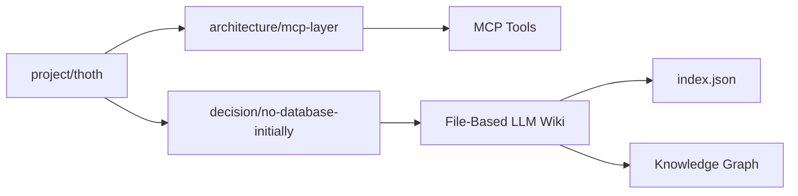
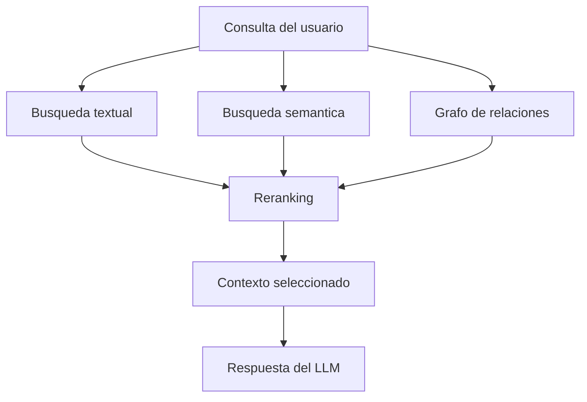

# Roadmap

Este roadmap define una evolucion incremental para T.H.O.T.H., desde una LLM Wiki basada en archivos hasta un sistema con indices, grafos y RAG.

La decision inicial es evitar una base de datos obligatoria. Los archivos Markdown deben actuar como fuente de verdad, mientras que indices, grafos y embeddings pueden generarse como artefactos derivados.

## Fase 1: File-Based LLM Wiki

Objetivo: construir una memoria local simple, legible y usable sin base de datos.

Capacidades:

- workspace local con `wiki/`
- documentos Markdown con frontmatter YAML
- IDs estables
- tipos de documento iniciales
- relaciones declaradas en metadatos
- log global append-only (`log.md`) y timelines por proyecto en `timelines/`
- CLI basica para inicializar, capturar, listar y mostrar documentos
- MCP basico para captura y consulta desde conversaciones LLM

Resultado esperado:

```text
wiki/
  index.md
  projects/
  notes/
  ideas/
  decisions/
  research/
  entities/
  timelines/
```

## Fase 2: Indices Derivados

Objetivo: mejorar busqueda, trazabilidad y rendimiento sin cambiar la fuente de verdad.

Capacidades:

- `index.json` derivado de documentos Markdown
- `relations.json` derivado de relaciones declaradas
- `sessions.json` para resumenes y continuidad conversacional
- busqueda textual local
- validacion de frontmatter
- deteccion simple de duplicados
- soporte inicial para topic keys

Estructura posible:

```text
wiki/
  .thoth/
    index.json
    relations.json
    sessions.json
```

Los archivos dentro de `.thoth/` deben poder regenerarse a partir de la wiki siempre que sea posible.

## Fase 3: Grafo de Conocimiento

Objetivo: representar documentos, entidades y relaciones como un grafo navegable.

Modelo conceptual:

- documentos como nodos
- entidades como nodos
- relaciones como aristas
- tags como agrupadores
- proyectos como subgrafos



Capacidades:

- exportacion de grafo en JSON
- visualizacion basica
- deteccion de nodos huerfanos
- deteccion de relaciones rotas
- navegacion por vecindad de documentos
- compatibilidad futura con Obsidian u otras herramientas de grafo

## Fase 4: RAG

Objetivo: permitir recuperacion semantica de conocimiento para respuestas mas precisas del LLM.

Capacidades:

- chunking de documentos Markdown
- embeddings opcionales
- vector store opcional
- recuperacion semantica
- reranking
- contexto progresivo para conversaciones LLM
- mezcla de busqueda textual, metadatos, grafo y similitud semantica

Flujo esperado:



## Fase 5: Backends Opcionales

Objetivo: permitir almacenamiento avanzado sin abandonar la portabilidad inicial.

La wiki basada en archivos debe seguir siendo una opcion valida.

Backends posibles:

- SQLite para busqueda e indices locales
- bases vectoriales para RAG
- almacenamiento remoto para sincronizacion
- backend cloud opcional
- exportacion/importacion entre backends

Principio clave:

Los backends avanzados deben ser opcionales. No deben ser necesarios para usar T.H.O.T.H. en su forma basica.

## Fase 6: Ecosistema de Agentes y Skills

Objetivo: convertir T.H.O.T.H. en una plataforma extensible.

Capacidades:

- registro de agentes
- registro de skills
- contratos de entrada/salida
- instalacion de paquetes de skills
- perfiles por dominio
- agentes especializados para escritura, investigacion, lore, codigo o documentacion

## Prioridad Inicial

La prioridad tecnica inmediata es construir una base simple y fiable:

1. estructura del proyecto
2. workspace local
3. lectura y escritura de Markdown con frontmatter
4. indice local derivado
5. CLI minima
6. MCP minimo
7. Memory Protocol basico
8. skill pack LLM Wiki para config, ingest, query, lint, integrate y crystallize

Solo despues deberian entrar grafo, RAG y backends opcionales.
