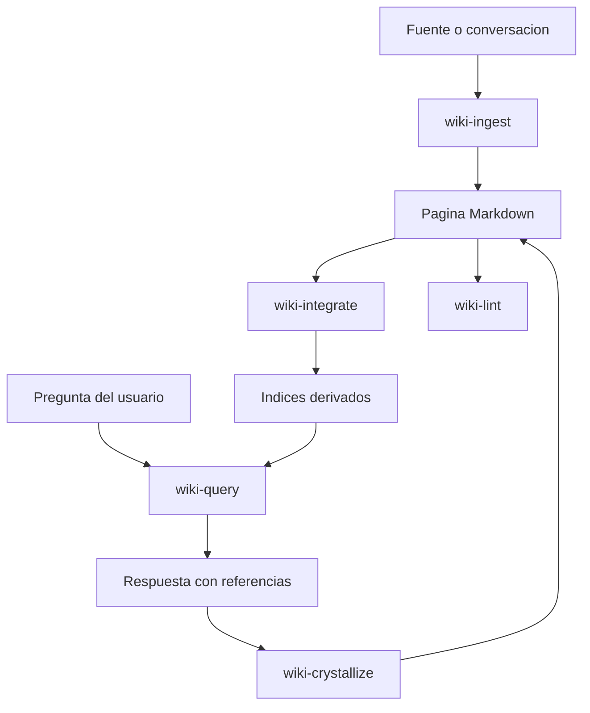

# LLM Wiki Skill Pack

Este skill pack adapta a T.H.O.T.H. el patron **LLM Wiki** inspirado por Andrej Karpathy y por implementaciones comunitarias como:

- `vanillaflava/llm-wiki-skills`
- `lewislulu/llm-wiki-skill`
- la propuesta original de Karpathy sobre wikis compiladas por LLMs

No copia codigo externo. Define una adaptacion propia para el modelo de agentes, MCP, CLI y almacenamiento file-based de T.H.O.T.H.

## Idea Central

Una LLM Wiki no debe ser solo una carpeta de notas ni un RAG pasivo sobre documentos crudos.

El LLM debe ayudar a **compilar conocimiento**: leer fuentes, sintetizar, enlazar, revisar, integrar y cristalizar aprendizajes de conversaciones en paginas Markdown persistentes.

La wiki se vuelve mas util con cada fuente procesada, cada pregunta relevante y cada sesion cristalizada.

## Skills Iniciales

| Skill | Funcion | Agente principal |
| --- | --- | --- |
| `wiki-config` | Configurar y validar la wiki. | `thoth-core` |
| `wiki-ingest` | Procesar informacion nueva y convertirla en paginas wiki. | `archivist` |
| `wiki-query` | Consultar la wiki con recuperacion progresiva. | `librarian` |
| `wiki-lint` | Revisar salud de la wiki, enlaces, metadatos e inconsistencias. | `indexer` |
| `wiki-integrate` | Integrar paginas nuevas o modificadas en relaciones e indices. | `indexer` |
| `wiki-crystallize` | Convertir una sesion o conversacion en memoria duradera. | `archivist` |

## Diferencia Frente a RAG Clasico

RAG clasico recupera fragmentos de fuentes crudas en cada consulta.

LLM Wiki compila conocimiento en paginas estables, legibles y enlazadas.

T.H.O.T.H. podra usar RAG en el futuro, pero como capa derivada sobre una wiki ya curada, no como sustituto de la memoria estructurada.

## Ruta de Wiki

La wiki no tiene que estar dentro del repositorio.

En este workspace, la ruta se define en `thoth.config.json`:

```json
{
  "wikiPath": "../wiki"
}
```

Todas las skills deben respetar esa ruta y no asumir que la wiki vive dentro del repo.

## Principios Operativos

- Markdown es la fuente de verdad.
- Los indices son derivados y regenerables.
- La wiki debe ser legible sin ejecutar T.H.O.T.H.
- Las respuestas valiosas pueden convertirse en memoria mediante crystallization.
- Las paginas nuevas deben integrarse con backlinks, relaciones o indices.
- Las operaciones ambiguas deben pedir confirmacion.
- La wiki debe poder crecer sin perder coherencia.

## Flujo General



## Atribucion

Este skill pack se inspira en el patron LLM Wiki de Andrej Karpathy y en implementaciones comunitarias recientes. T.H.O.T.H. mantiene una adaptacion propia para su arquitectura de agentes, MCP y almacenamiento file-based.
